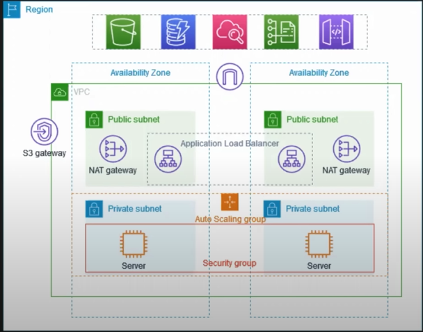
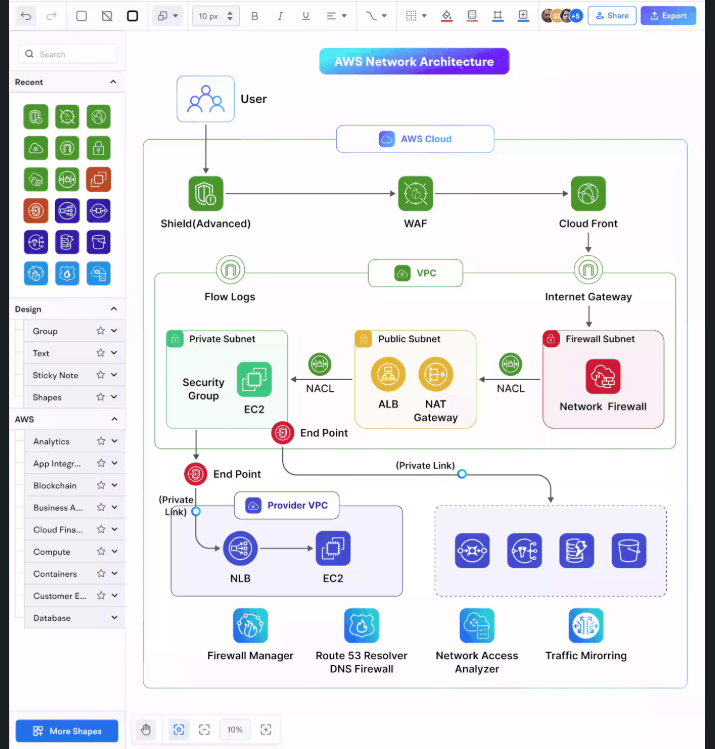

# VPC Setup with Resiliency and Security

This example demonstrates how to create a Virtual Private Cloud (VPC) designed for production environments. The architecture improves resiliency and security by deploying resources across multiple Availability Zones (AZs).

## Overview
- **Multi-AZ Resiliency**: The VPC spans two Availability Zones to ensure high availability. If one AZ becomes unavailable, the other AZ continues handling traffic.
- **Public and Private Subnets**:
  - Public subnets contain the NAT gateways and the Application Load Balancer (ALB).
  - Private subnets host the application servers, ensuring they remain secure and unreachable directly from the internet.
- **Traffic Flow**:
  - Servers in private subnets receive traffic from the load balancer.
  - Outbound connections to the internet (e.g., API requests) are routed through the NAT gateways.

## Key Components

### 1. **NAT Gateway**
- NAT Gateway allows private instances (e.g., application servers) to access the internet or external APIs securely.
- It hides the private IP addresses of the servers by replacing them with its public IP address before sending requests to the internet.

### 2. **Auto Scaling Group**
- The Auto Scaling Group automatically adjusts the number of instances based on demand.
- For example, when CPU usage exceeds a set threshold (e.g., 70%), the group scales up the number of servers to handle additional traffic efficiently.

### 3. **Application Load Balancer (ALB)**
- The load balancer distributes incoming traffic across multiple servers in a balanced way.
- It ensures optimized performance by preventing any single server from being overwhelmed.

### 4. **Private Subnets**
- Servers are deployed in private subnets for security purposes.
- These servers do not have public IP addresses and cannot be accessed directly from the internet.
- Secure access is maintained through other methods like a bastion host or VPN.

### 5. **High Availability with Multiple AZs**
- Deploying resources in two Availability Zones ensures that the system remains operational even if one AZ fails.

---

## Architecture Diagram

---

## Benefits
1. **High Availability**: Resources deployed in multiple AZs ensure failover during outages.
2. **Enhanced Security**: Private subnets protect servers from direct internet access.
3. **Scalability**: Auto Scaling adjusts server capacity based on demand.
4. **Optimized Performance**: Load balancer ensures efficient traffic distribution.
