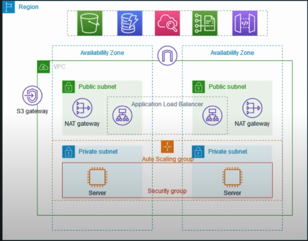
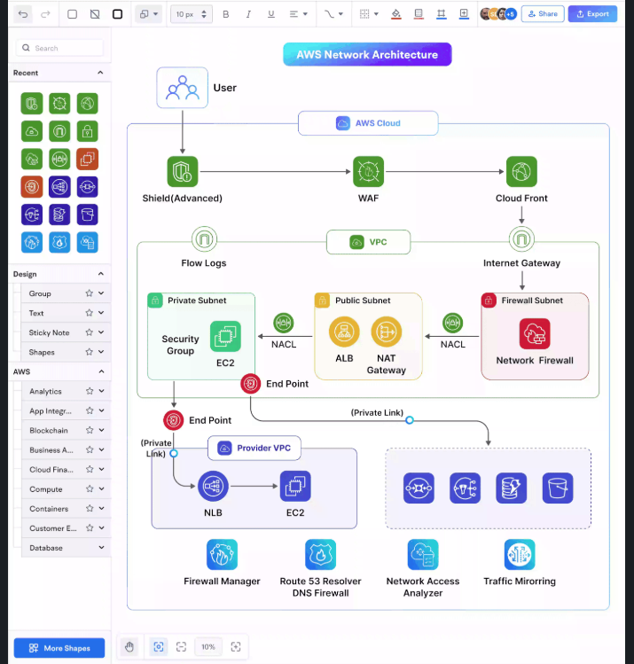

# VPC Setup with Resiliency and Security

This example demonstrates how to create a Virtual Private Cloud (VPC) designed for production environments. The architecture improves resiliency and security by deploying resources across multiple Availability Zones (AZs).

## Overview
- **Multi-AZ Resiliency**: The VPC spans two Availability Zones to ensure high availability. If one AZ becomes unavailable, the other AZ continues handling traffic.
- **Public and Private Subnets**:
  - Public subnets contain the NAT gateways and the Application Load Balancer (ALB).
  - Private subnets host the application servers, ensuring they remain secure and unreachable directly from the internet.
- **Traffic Flow**:
  - Servers in private subnets receive traffic from the load balancer.
  - Outbound connections to the internet (e.g., API requests) are routed through the NAT gateways.

## Key Components

### 1. **NAT Gateway**
- NAT Gateway allows private instances (e.g., application servers) to access the internet or external APIs securely.
- It hides the private IP addresses of the servers by replacing them with its public IP address before sending requests to the internet.

### 2. **Auto Scaling Group**
- The Auto Scaling Group automatically adjusts the number of instances based on demand.
- For example, when CPU usage exceeds a set threshold (e.g., 70%), the group scales up the number of servers to handle additional traffic efficiently.

### 3. **Application Load Balancer (ALB)**
- The load balancer distributes incoming traffic across multiple servers in a balanced way.
- It ensures optimized performance by preventing any single server from being overwhelmed.

### 4. **Private Subnets**
- Servers are deployed in private subnets for security purposes.
- These servers do not have public IP addresses and cannot be accessed directly from the internet.
- Secure access is maintained through other methods like a bastion host or VPN.

### 5. **High Availability with Multiple AZs**
- Deploying resources in two Availability Zones ensures that the system remains operational even if one AZ fails.

---

## Architecture Diagram

---
# 📘 AWS Target Group – Explained

## 📌 What is a Target Group?

A **Target Group** in AWS defines a set of backend resources (like EC2 instances, IP addresses, or Lambda functions) that receive traffic from a **Load Balancer**.

When a request reaches your Load Balancer, the target group decides *where* that traffic should go.

---

## 🧱 Components of a Target Group

- **🎯 Targets**: Resources like:
  - EC2 Instances
  - IP Addresses
  - Lambda Functions

- **📡 Health Checks**:
  - Regularly check the status of targets.
  - Only healthy targets receive traffic.

- **🔌 Protocol & Port**:
  - Protocols like HTTP, HTTPS, TCP.
  - Port numbers like 80 or 443 for traffic routing.

---

## 🎯 Example Use Case

You have 3 EC2 instances running a web app:

1. Create a **target group** and register all 3 instances.
2. Create an **Application Load Balancer (ALB)**.
3. Attach the target group to a **listener rule**.
4. Incoming traffic is routed to the healthy instances.

---

## 🔄 Load Balancer & Target Group Relationship

- ✅ First, **create the target group**.
- 🔗 Then, **attach it to a load balancer listener rule**.
- 🎯 This ensures efficient traffic routing and automatic scaling.

---

## 🛠️ Benefits of Using Target Groups

- Fine-grained traffic routing
- Dynamic health checks
- Easy to register/deregister instances
- Works well with **Auto Scaling**

---

## 📚 Related AWS Concepts

- [Elastic Load Balancer (ELB)](https://docs.aws.amazon.com/elasticloadbalancing/latest/userguide/what-is-load-balancing.html)
- [Health Checks](https://docs.aws.amazon.com/elasticloadbalancing/latest/application/target-group-health-checks.html)
- [Listener Rules](https://docs.aws.amazon.com/elasticloadbalancing/latest/application/load-balancer-listeners.html)

---

> 💡 **Tip:** Always create your target group *before* creating or configuring your Load Balancer to avoid dependency issues.

## Benefits
1. **High Availability**: Resources deployed in multiple AZs ensure failover during outages.
2. **Enhanced Security**: Private subnets protect servers from direct internet access.
3. **Scalability**: Auto Scaling adjusts server capacity based on demand.
4. **Optimized Performance**: Load balancer ensures efficient traffic distribution.
